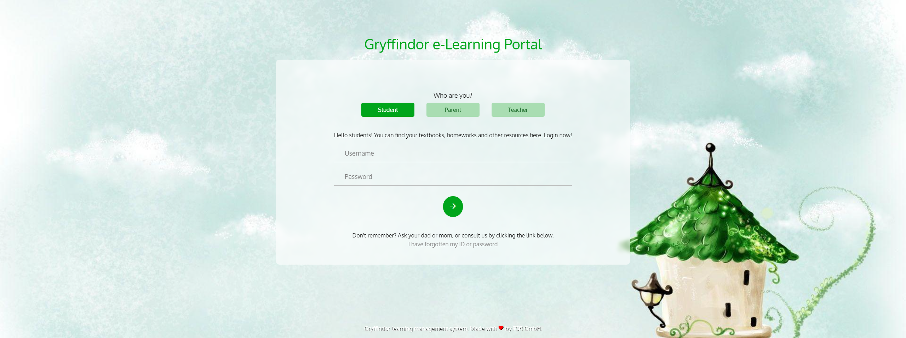

# Primary School Learning Management System (LMS)
A learning management system designed to cater towards primary school students. A project done in 2020 to get PHP experiences.

# Features
## Interactive and friendly login screen
The system supports login from a variety of roles:
- Students: username and password as given by the faculty
- Parents: register account allowed
- Teacher: id and password given by the administrator

## Main dashboard and summaries
The dashboard shows several summary that are important and may be unique to roles.
- Announcement: announcements as given by the school
- Inbox: personal notifications unique to role
- Courses: quick access to courses
- Assignments and exams: highlights current assignments and exams
